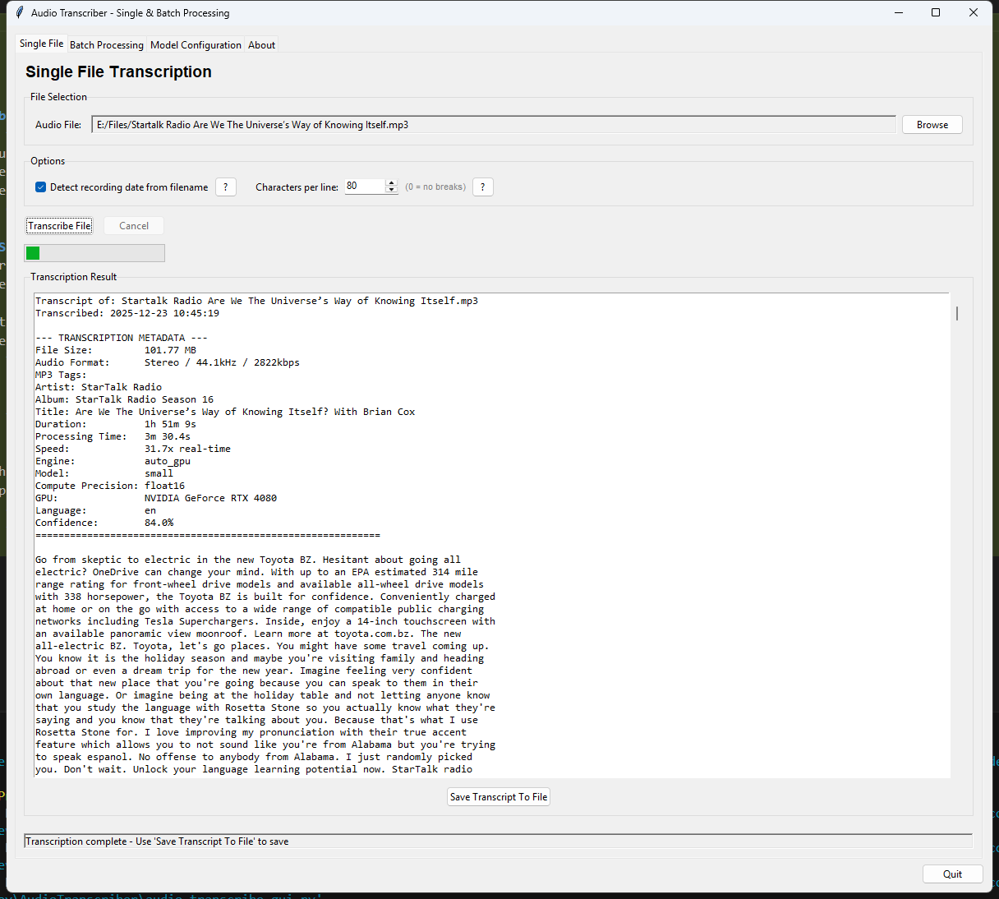

# Audio Transcriber

A powerful desktop application for converting audio files into text using OpenAI's Whisper speech recognition models. Features both a graphical user interface (GUI) and command-line interface (CLI) with GPU acceleration support.


## About This Project

I'm Adam Moses, and I wanted to create a simple-to-use audio transcription program using open source tools. My goal was to make something that's fast and leverages GPU acceleration where possible, making it especially useful for podcasts and other long-form content. I intend to add more capabilities over time, continuously improving the tool based on real-world use cases.

**Project Repository**: [https://github.com/AdamMoses-GitHub/AudioTranscriber](https://github.com/AdamMoses-GitHub/AudioTranscriber)



## Features

### Core Capabilities
- **Dual Interface**: Full-featured GUI and comprehensive CLI
- **Single File Transcription**: Process individual audio files with detailed metadata
- **Batch Processing**: Transcribe multiple files with progress tracking and summary reports
- **GPU Acceleration**: NVIDIA CUDA support for up to 10x real-time processing speed
- **Multiple Engines**: Choose between OpenAI Whisper or optimized Faster-Whisper
- **Flexible Configuration**: 7 model sizes (tiny to large-v3) balancing speed, accuracy, and VRAM usage

### Audio Support
- **Formats**: MP3, WAV, M4A, FLAC, AAC, OGG, WebM
- **Metadata Extraction**: Automatically reads MP3 ID3 tags (artist, album, title, etc.)
- **Date Detection**: Extracts recording dates from filenames (YYYY-MM-DD, YYYYMMDD, MM-DD-YYYY, Month DD YYYY)

### Advanced Features
- **Text Formatting**: Configurable line breaks with word preservation
- **Batch Options**: Skip existing transcripts, preserve folder structure, recursive processing
- **Detailed Metadata**: File size, duration, processing time, speed ratio, confidence scores
- **Auto Language Detection**: Identifies spoken language automatically
- **Progress Tracking**: Real-time progress indicators with ETA estimates
- **Configuration Persistence**: Automatically saves and restores your preferences

## Installation

### Prerequisites
- Python 3.8 or higher
- NVIDIA GPU with CUDA support (optional, for GPU acceleration)
- FFmpeg (for advanced audio format support)

### Basic Installation

1. **Clone or download this repository**
   ```bash
   cd Audio2
   ```

2. **Install Python dependencies**
   ```bash
   pip install -r requirements.txt
   ```

3. **Install FFmpeg** (if not already installed)
   - **Windows**: `choco install ffmpeg` or download from [ffmpeg.org](https://ffmpeg.org/download.html)
   - **macOS**: `brew install ffmpeg`
   - **Linux**: `sudo apt-get install ffmpeg`

### GPU Acceleration Setup (Optional but Recommended)

For NVIDIA GPU acceleration, install PyTorch with CUDA support:

```bash
# For CUDA 11.8
pip install torch torchvision torchaudio --index-url https://download.pytorch.org/whl/cu118

# For CUDA 12.1
pip install torch torchvision torchaudio --index-url https://download.pytorch.org/whl/cu121
```

**Verify GPU availability:**
```bash
python -c "import torch; print(f'GPU Available: {torch.cuda.is_available()}')"
```

**Important**: The default `pip install torch` provides CPU-only support. You must explicitly install the CUDA version for GPU acceleration.

### Installation Notes

- **Faster-Whisper**: May fail to install on Python 3.14+ due to `av` package compilation issues. The application works fine with OpenAI Whisper alone.
- **tkinter**: Included with standard Python installations
- **Conda users**: Activate your environment before installation

## Usage

### Graphical User Interface (GUI)

Launch the GUI application:

```bash
python audio_transcribe_gui.py
```

#### GUI Features

**Single File Tab**
1. Click "Browse" to select an audio file
2. Configure options (date detection, line formatting)
3. Click "Transcribe File" to start processing
4. View results in the text area
5. Click "Save Transcript To File" to save (optional)

**Batch Processing Tab**
1. Select input folder containing audio files
2. Select output folder for transcripts
3. Configure options:
   - Skip existing transcripts
   - Create summary report
   - Preserve folder structure
   - Recursive subdirectory search
4. Click "Start Batch Processing"
5. Monitor progress in real-time log

**Model Configuration Tab**
- Choose transcription engine (auto_gpu, whisper, faster_whisper)
- Select model size (tiny to large-v3)
- Set compute precision (int8, float16, float32)
- Download models and view model information
- Check GPU status and capabilities

**About Tab**
- View application features and system information
- Check GPU availability and device details

### Command-Line Interface (CLI)

The CLI provides the same functionality as the GUI with scriptable access.

#### Single File Transcription

**Basic usage:**
```bash
python audio_transcribe_cli.py single input.mp3
```

**With custom output:**
```bash
python audio_transcribe_cli.py single input.mp3 -o transcript.txt
```

**With model selection:**
```bash
python audio_transcribe_cli.py single input.mp3 --model large --engine whisper
```

**Full example with all options:**
```bash
python audio_transcribe_cli.py single recording.mp3 \
  --output transcript.txt \
  --model small \
  --engine faster_whisper \
  --compute float16 \
  --chars-per-line 100 \
  --no-detect-date
```

#### Batch Processing

**Basic batch:**
```bash
python audio_transcribe_cli.py batch input_folder output_folder
```

**Recursive with structure preservation:**
```bash
python audio_transcribe_cli.py batch input_folder output_folder \
  --recursive \
  --preserve-structure \
  --skip-existing \
  --create-summary
```

**Full batch example:**
```bash
python audio_transcribe_cli.py batch ./recordings ./transcripts \
  --model medium \
  --engine auto_gpu \
  --compute float16 \
  --chars-per-line 80 \
  --recursive \
  --preserve-structure \
  --skip-existing \
  --create-summary
```

#### System Information

Check your setup:
```bash
python audio_transcribe_cli.py info
```

#### CLI Arguments

**Single File Options:**
- `INPUT_FILE`: Audio file to transcribe (required)
- `-o, --output`: Output file path (optional, defaults to input name with .txt)
- `--engine`: whisper | faster_whisper | auto_gpu (default: auto_gpu)
- `--model`: tiny | base | small | medium | large | large-v2 | large-v3 (default: base)
- `--compute`: int8 | int8_float16 | float16 | float32 (default: float16)
- `--detect-date`: Enable date detection (default: enabled)
- `--no-detect-date`: Disable date detection
- `--chars-per-line N`: Characters per line, 0=no breaks (default: 80)

**Batch Processing Options:**
- `INPUT_FOLDER`: Folder with audio files (required)
- `OUTPUT_FOLDER`: Folder for transcripts (required)
- All single file options, plus:
- `--skip-existing`: Skip files with existing transcripts
- `--create-summary`: Generate batch summary report
- `--preserve-structure`: Maintain input folder hierarchy
- `--recursive`: Search subdirectories for audio files

**Get Help:**
```bash
python audio_transcribe_cli.py --help
python audio_transcribe_cli.py single --help
python audio_transcribe_cli.py batch --help
```

## Model Comparison

| Model | Parameters | VRAM | Speed (GPU) | Accuracy | Best For | Download Size |
|-------|-----------|------|-------------|----------|----------|---------------|
| tiny | 39M | ~0.2GB | 30-50x | Basic | Quick drafts | ~75MB |
| base | 74M | ~0.5GB | 20-40x | Good | **General use** | ~150MB |
| small | 244M | ~1GB | 10-20x | Better | High quality | ~500MB |
| medium | 769M | ~2GB | 5-10x | High | Professional | ~1.5GB |
| large-v3 | 1550M | ~6GB | 2-5x | Highest | Critical accuracy | ~3GB |

**Recommendation**: Start with `base` model for general use. Upgrade to `small` or `medium` for better accuracy if you have sufficient VRAM.

## Project Structure

```
Audio2/
├── audio_transcribe_gui.py          # GUI application entry point
├── audio_transcribe_cli.py          # CLI application entry point
├── requirements.txt                 # Python dependencies
├── transcriber_config.json          # Saved configuration
│
├── config/                          # Configuration management
│   ├── constants.py                 # Model specs, extensions, etc.
│   ├── environment.py               # GPU detection, library checks
│   └── config_manager.py            # Settings persistence
│
├── models/                          # Model management
│   └── model_manager.py             # Load, download, cleanup models
│
├── transcription/                   # Core transcription logic
│   ├── transcriber.py               # Single file transcription
│   ├── metadata_extractor.py        # Audio metadata extraction
│   └── batch_processor.py           # Batch processing engine
│
├── utilities/                       # Helper functions
│   ├── file_utils.py                # File operations
│   ├── format_utils.py              # Text formatting
│   ├── date_parser.py               # Date detection from filenames
│   └── audio_utils.py               # Audio info formatting
│
└── ui/                              # GUI components
    ├── main_window.py               # Main application window
    └── tabs/                        # Individual tab implementations
        ├── single_file_tab.py       # Single file interface
        ├── batch_tab.py             # Batch processing interface
        ├── model_config_tab.py      # Model configuration
        └── about_tab.py             # About information
```

## Configuration

### GUI Configuration
- Settings are automatically saved to `transcriber_config.json`
- Persisted settings include:
  - Selected engine, model, and compute type
  - File paths and folder selections
  - Processing options (date detection, line formatting)
  - Batch processing preferences

### CLI Configuration
- All settings specified via command-line arguments
- No persistent configuration for CLI mode
- Use shell scripts or aliases for repeated configurations

## Transcript Format

Generated transcripts include comprehensive metadata:

```
Transcript of: recording.mp3
Recording Date: 2024-03-15 (Friday)
Transcribed: 2024-03-15 14:30:00

--- TRANSCRIPTION METADATA ---
File Size:         25.50 MB
Audio Format:      MP3, 192 kbps, 44100 Hz, Stereo
MP3 Tags:
  Title: Interview Session
  Artist: John Doe
  Album: 2024 Recordings
Duration:          0:15:30
Processing Time:   0:01:45
Speed:             8.9x real-time
Engine:            faster_whisper
Model:             base
Compute Precision: float16
GPU:               NVIDIA GeForce RTX 3080
Language:          en
Confidence:        89.5%
============================================================

[Transcribed text content follows here...]
```

## Troubleshooting

### GPU Not Detected

**Problem**: Application shows "CPU Only" despite having an NVIDIA GPU

**Solution**:
1. Verify CUDA installation: `nvidia-smi`
2. Install PyTorch with CUDA support:
   ```bash
   pip install torch torchvision torchaudio --index-url https://download.pytorch.org/whl/cu118
   ```
3. Verify: `python -c "import torch; print(torch.cuda.is_available())"`

### Faster-Whisper Installation Fails

**Problem**: `av` package compilation errors on Python 3.14+

**Solution**:
- This is expected on newer Python versions
- The application works perfectly with OpenAI Whisper alone
- Set engine to "whisper" instead of "faster_whisper"

### FFmpeg Not Found

**Problem**: Error processing certain audio formats

**Solution**:
1. Install FFmpeg:
   - Windows: `choco install ffmpeg`
   - macOS: `brew install ffmpeg`
   - Linux: `sudo apt-get install ffmpeg`
2. Restart application

### Out of VRAM

**Problem**: GPU runs out of memory during processing

**Solution**:
1. Use a smaller model (base instead of medium/large)
2. Use lower precision (int8 instead of float16)
3. Close other GPU-intensive applications
4. Fall back to CPU mode (slower but unlimited memory)

### Slow Processing on CPU

**Problem**: Transcription takes much longer than real-time

**Expected Behavior**: CPU processing is slower than GPU:
- **GPU**: 2-50x real-time (depending on model)
- **CPU**: 0.1-1x real-time (slower than audio playback)

**Solutions**:
1. Enable GPU acceleration (see GPU setup above)
2. Use smaller model (tiny/base for CPU)
3. Use int8 compute type for better CPU performance

### Inaccurate Transcriptions

**Problem**: Text doesn't match audio well

**Solutions**:
1. Use larger model (medium or large-v3)
2. Ensure audio quality is good (not heavily compressed)
3. Check if audio language is supported by Whisper
4. Use higher precision (float16 or float32)

## Performance Tips

1. **For Best Speed**: Use `tiny` or `base` model with GPU and float16 precision
2. **For Best Accuracy**: Use `large-v3` model with GPU and float32 precision
3. **For Batch Processing**: Enable `--skip-existing` to resume interrupted jobs
4. **For Large Collections**: Use `--preserve-structure` with `--recursive` to maintain organization
5. **For Limited VRAM**: Start with `base` model and int8 precision

## System Requirements

### Minimum
- Python 3.8+
- 4GB RAM
- 2GB free disk space (for models)
- CPU: Any modern processor

### Recommended
- Python 3.10+
- 8GB+ RAM
- NVIDIA GPU with 4GB+ VRAM
- 10GB free disk space
- CPU: Multi-core processor

### Optimal
- Python 3.11+
- 16GB+ RAM
- NVIDIA GPU with 8GB+ VRAM (RTX 3060 or better)
- 20GB free disk space
- CPU: 6+ cores

## Known Limitations

- **Language Support**: Best results with English; other languages supported but may have lower accuracy
- **Audio Quality**: Poor quality recordings will have lower transcription accuracy
- **Speaker Separation**: Does not distinguish between multiple speakers
- **Python 3.14**: Faster-Whisper may not install due to av package issues
- **macOS ARM**: Some CUDA features may not be available on Apple Silicon

## Contributing

This is a personal project, but suggestions and bug reports are welcome. Feel free to:
- Report issues
- Suggest features
- Share usage tips
- Provide feedback

## License

MIT License - See LICENSE file for details

## Acknowledgments

- **OpenAI Whisper**: Core speech recognition technology
- **Faster-Whisper**: Optimized implementation by guillaumekln
- **PyTorch**: GPU acceleration framework
- **FFmpeg**: Audio format conversion

## Version History

### Version 1.0 (Current)
- Full GUI with tabbed interface
- Comprehensive CLI with all GUI features
- GPU acceleration support
- Batch processing with progress tracking
- Automatic date detection
- Metadata extraction (MP3 tags)
- Text formatting options
- Configuration persistence
- Help system with detailed explanations
- About tab with system information

## Contact & Support

For questions, issues, or suggestions, please create an issue in the repository or contact the maintainer.

---

**Made with ❤️ using OpenAI Whisper**
