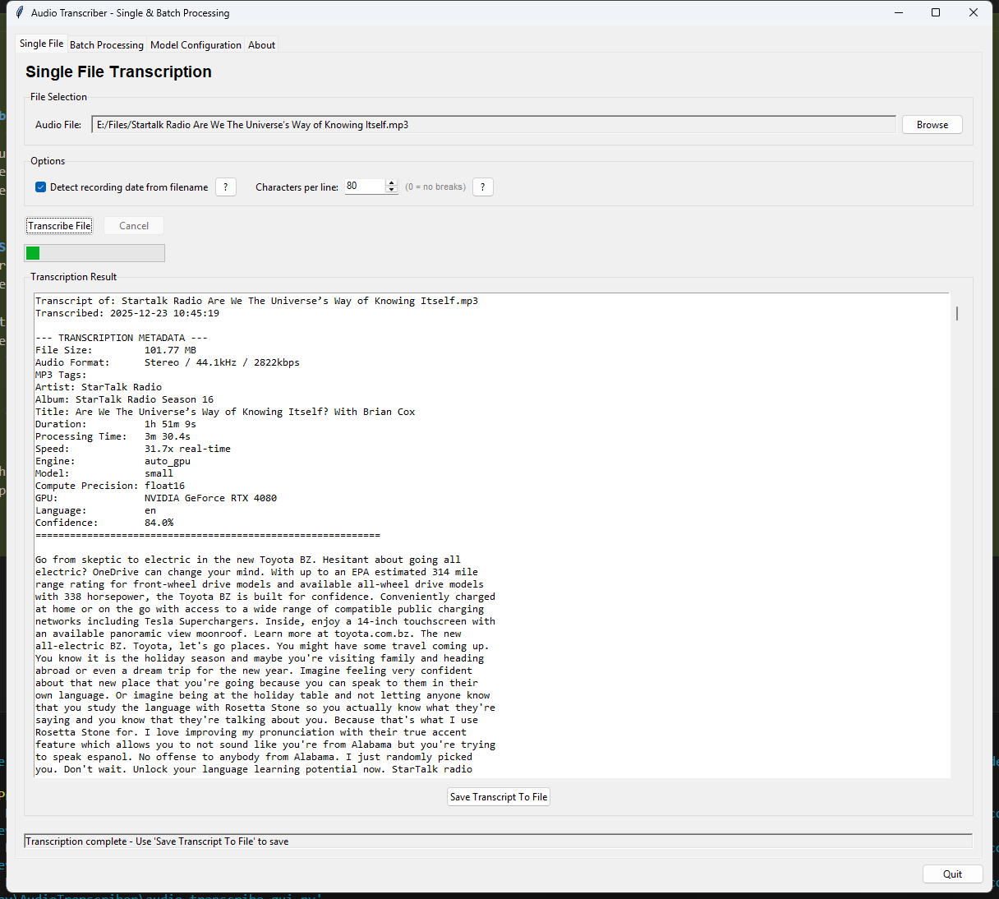

# Audio Transcriber

_Because typing out your 3-hour podcast by hand is a form of self-punishment nobody deserves._


A desktop application that turns your audio files into text using OpenAI's Whisper AI models. It's got both a pretty GUI for clickers and a CLI for keyboard warriors. With GPU acceleration, it can transcribe faster than your audio actually plays—which is basically magic, if you think about it.



## About This Project

Hi, I'm Adam Moses. I got tired of manually transcribing audio files (because apparently I had nothing better to do with my time), so I built this tool using open source components. The goal was simple: make something fast, GPU-accelerated when possible, and actually useful for podcasts and long-form content. 

I'll keep adding features as I discover new ways to procrastinate on my actual work.

**Project Repository**: [https://github.com/AdamMoses-GitHub/AudioTranscriber](https://github.com/AdamMoses-GitHub/AudioTranscriber)

## What It Does

### The Headline Features
- **Two Ways to Use It**: Clickable GUI or command-line ninja mode
- **Single Files or Armies**: Transcribe one file or batch-process your entire audio library
- **GPU Go Brrrr**: NVIDIA CUDA support for speeds up to 50x real-time (yes, really)
- **Multiple Engine Options**: OpenAI Whisper or Faster-Whisper (which is, as the name suggests, faster)
- **7 Model Sizes**: From "tiny but confused" to "large and knows everything"

### Audio Format Buffet
Supports MP3, WAV, M4A, FLAC, AAC, OGG, and WebM. If it makes noise, we'll probably transcribe it.

### The Nerdy Stuff
- Extracts metadata from MP3 files (artist, album, that one song you definitely didn't download illegally)
- Detects dates in filenames (even if you named them like a psychopath)
- Smart text formatting that doesn't break words mid-syll-able
- Batch processing with "skip existing" so you can restart without redoing everything
- Real-time progress tracking because watching bars fill up is oddly satisfying

## Quick Start

Want details? Check out [INSTALL_AND_USAGE.md](INSTALL_AND_USAGE.md) for the full installation guide, troubleshooting, and CLI reference.

**TL;DR Version:**
```bash
pip install -r requirements.txt
python audio_transcribe_gui.py  # For GUI
python audio_transcribe_cli.py single your_file.mp3  # For CLI
```

**Want GPU speed?** Install PyTorch with CUDA:
```bash
pip install torch torchvision torchaudio --index-url https://download.pytorch.org/whl/cu118
```

## Model Cheat Sheet

| Model | VRAM | Speed | Accuracy | Use When |
|-------|------|-------|----------|----------|
| tiny | 0.2GB | Sonic fast | Meh | You're impatient |
| base | 0.5GB | Pretty fast | Good enough | **Start here** |
| small | 1GB | Still quick | Better | You care about quality |
| medium | 2GB | Decent | Really good | You're serious |
| large-v3 | 6GB | Slower | Best | Perfection or bust |

## What Else?

- **License**: MIT (do whatever, just don't blame me)
- **Contributing**: It's a personal project, but bug reports and suggestions are welcome
- **Known Issues**: Doesn't distinguish between speakers, won't fix your life problems
- **Requirements**: Python 3.8+, optional GPU with CUDA, FFmpeg for audio format wizardry

## Detailed Documentation

- **[INSTALL_AND_USAGE.md](INSTALL_AND_USAGE.md)** - Complete installation instructions, usage guide, troubleshooting, and CLI reference
- **[COMMAND_LINE.md](COMMAND_LINE.md)** - Additional CLI documentation
- **[TODO.md](TODO.md)** - Future plans and feature wishlist

## Version History

**1.0** - The "it actually works" release. GUI, CLI, GPU acceleration, batch processing, and enough features to justify the version number.

---

<sub>Keywords: audio transcription, speech-to-text, Whisper, GPU acceleration, CUDA, podcast transcription, batch processing, Python, desktop app, CLI, open source, machine learning, AI transcription</sub>


