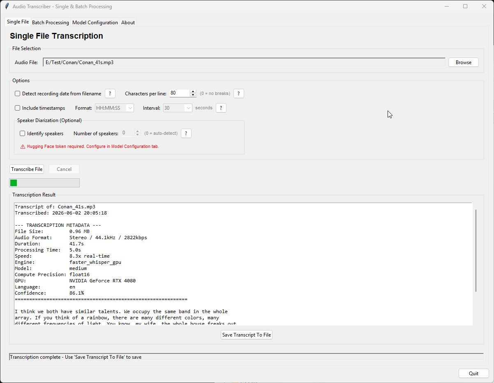

# Audio Transcriber

_Because typing out your 3-hour podcast by hand is a form of self-punishment nobody deserves._


A desktop application that turns your audio files into text using OpenAI's Whisper AI models. It's got both a pretty GUI for clickers and a CLI for keyboard warriors. With GPU acceleration, it can transcribe faster than your audio actually plays—which is basically magic, if you think about it.



## About This Project

Hi, I'm Adam Moses. I got tired of manually transcribing audio files (because apparently I had nothing better to do with my time), so I built this tool using open source components. The goal was simple: make something fast, GPU-accelerated when possible, and actually useful for podcasts and long-form content. 

I'll keep adding features as I discover new ways to procrastinate on my actual work.

**Project Repository**: [https://github.com/AdamMoses-GitHub/AudioTranscriber](https://github.com/AdamMoses-GitHub/AudioTranscriber)

## What It Does

### The Headline Features
- **Two Ways to Use It**: Clickable GUI or command-line ninja mode
- **Single Files or Armies**: Transcribe one file or batch-process your entire audio library
- **GPU Go Brrrr**: NVIDIA CUDA support for speeds up to 50x real-time (yes, really)
- **Multiple Engine Options**: OpenAI Whisper or Faster-Whisper (which is, as the name suggests, faster)
- **6 Model Sizes**: From `tiny` (quick & dirty) to `large-v3` (maximum respect), plus the new `turbo` for when you want speed *and* quality
- **Speaker Diarization**: Who said what? pyannote.audio labels each speaker so you don't have to guess
- **Timestamps**: Embed navigation markers at configurable intervals so you can jump to any point in a long transcript

### Audio Format Buffet
Supports MP3, WAV, M4A, FLAC, AAC, OGG, and WebM. If it makes noise, we'll probably transcribe it.

### The Nerdy Stuff
- Extracts metadata from MP3 files (artist, album, bitrate, sample rate—the works)
- Detects dates in filenames (even if you named them like a psychopath)
- Smart text formatting that doesn't break words mid-syll-able
- Batch processing with "skip existing" so you can restart without redoing everything
- Real-time progress tracking because watching bars fill up is oddly satisfying
- Configurable timestamp injection at 15s / 30s / 1 min / 2 min / 5 min / 10 min intervals
- Speaker diarization via pyannote.audio 3.1 — auto-detects speaker count or you can specify
- Transcript headers now include diarization metadata: enabled/disabled state, requested speaker count, detected speakers, diarization model, and Hugging Face token status (never the token itself)

## Quick Start

Want details? Check out [INSTALL_AND_USAGE.md](INSTALL_AND_USAGE.md) for the full installation guide, troubleshooting, and CLI reference.

**TL;DR Version:**
```bash
# GPU setup (recommended)
pip install -r requirements-gpu.txt

# CPU-only setup
pip install -r requirements-cpu.txt

python audio_transcribe_gui.py                        # GUI
python audio_transcribe_cli.py single your_file.mp3   # CLI
```

## Model Cheat Sheet

| Model | VRAM | Speed | Accuracy | Use When |
|-------|------|-------|----------|----------|
| tiny | ~0.2GB | 30-50x real-time | Meh | You're impatient |
| base | ~0.5GB | 20-40x real-time | Good enough | **Start here** |
| small | ~1GB | 10-20x real-time | Better | You care about quality |
| medium | ~2GB | 5-10x real-time | Really good | You're serious |
| turbo | ~3GB | 8-15x real-time | High | Speed *and* quality |
| large-v3 | ~6GB | 2-5x real-time | Best | Perfection or bust |

## What Else?

- **License**: MIT (do whatever, just don't blame me)
- **Contributing**: It's a personal project, but bug reports and suggestions are welcome
- **Known Issues**: Poor audio quality = poor transcripts. Won't fix your life problems either.
- **Requirements**: Python 3.8+, optional GPU with CUDA, FFmpeg for audio format wizardry

## Detailed Documentation

- **[INSTALL_AND_USAGE.md](INSTALL_AND_USAGE.md)** - Complete installation instructions, usage guide, troubleshooting, and CLI reference
- **[COMMAND_LINE.md](COMMAND_LINE.md)** - Additional CLI documentation
- **[TODO.md](TODO.md)** - Future plans and feature wishlist

## Version History

**1.0** - The "it actually works" release. GUI, CLI, GPU acceleration, batch processing, and enough features to justify the version number.

---

<sub>Keywords: audio transcription, speech-to-text, Whisper, faster-whisper, GPU acceleration, CUDA, podcast transcription, batch processing, Python, desktop app, CLI, open source, machine learning, AI transcription, speaker diarization, pyannote, timestamps, MP3 transcription, WAV transcription, turbo model, openai-whisper</sub>


